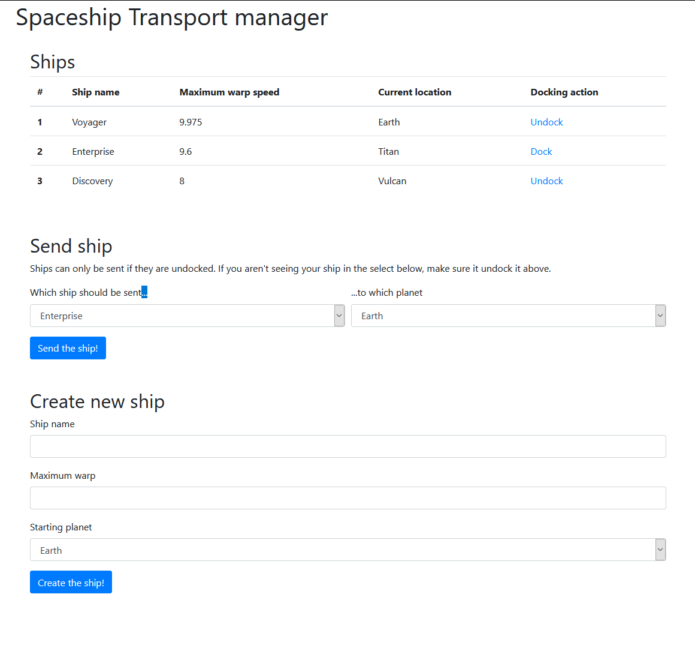

# Latest/Sage Orientation Normal Exam

## Getting Started

- **Fork** this repository under your own account
- Clone the forked repository under your account to your computer
- Create a `.gitignore` file so generated files won't be committed
- Commit your progress frequently and with descriptive commit messages
- All your answers and solutions should go in this repository

## Keep in mind

- You can use any resource online, but **please work individually**
- **Don't just copy-paste** your answers and solutions, use your own words
  instead
- **Don't push your work** to GitHub until your mentor announces that the time
  is up
- Before diving to coding **think about the structure**

# Space Transporter

The year is 2369. Humanity has evolved and managed to reach out to stars using
various warp capable space ships. However, human clumsiness and inability to organize without nicely organized tables still remains.

Our goal is to build application that will help us keep track of ships travelling
between planets in our newly founded galactic federation.

## Domain description

- Every ship has a name and maximum warp speed (floating-point number).
    - At any time, ship is located at one of the planets.
    - Ship can be either docked or undocked. Docked ships cannot travel
      to another planet until undocked.

- Planets are represented just by their name.
    - Each planet has its own maximum limit of how many ships it can have
      docked at any given time (some docking capacity).
    - If this limit is reached, no more ship can dock until more space
      becomes available (already docked ship undocking).
    - Assume that planet names are unique (you don't have to add
      this constraint/check yourself).

## Frontend



- You do not have to concern yourself with fancy styling. **Focus on
  functionality!**
- The **frontend** consists of a single page
  - a heading with the title of the site
  - table of existing ships as depicted above, which allows us
    to undock or dock ships (depending on their current state)
    by clicking a link
     - we are redirected back to main page after using the link
     - if we try to dock ship on a planet that has no more available
          docking capacity, ship will not be docked and we display
          "Docking capacity on planet XYZ reached!" error
     - XYZ is a placeholder name of the planet where we tried to dock


- form that allows us to move ship to a different planet using
    select fields
    - only ships that are currently undocked should be displayed
      as option in select field
  - form that allows us to create new ship

## Database

It is up to you to define what the database model will look
like, it just needs to help backend fulfill outlined functionality.

Note that DB might change accurancy of your warp speed when a ship
is saved. Do not concern yourself with this.

Only requirements are:

* all the ship and planet data needs to be stored in database
* ships and planets will be stored in separated tables
* there must be some relationship between these tables

## Endpoints

* **You might need more endpoints to implement all the functionality.** Following
endpoints are the mandatory ones.
* Your endpoints shouldn't be returning 500 status codes that would be a
result of **unvalidated user inputs**.

### GET `/`

- the endpoint should render an HTML displaying the frontend page
  as described above

### POST `/ships/{id}/move/`

- this endpoint should be responsible for moving the ship around

- ship cannot move unless undocked

- you should check if the `id` of ship provided in path is valid
- you should also check whether given ship is undocked

- save changes

- redirect back to the main page

### POST `/ships`

- this endpoint is responsible for creation of new ship

- newly created ship is undocked by default

### DELETE `/planets/{id}`

- this endpoints sends a Death Star to planet with given ID,
destroying the planet (and making millions of voices suddenly
cry out in terror)

- Any ships currently located on destroyed planet flee (both docked
and undocked ships), meaning they move to some other planet that remains.
  - It's up to you to decide which planet ships move to (can be random,
    can be first planet in database...)

- planet is removed from database

### GET `/ships?warpAtLeast=9.5`

- this endpoint should return information about space ships whose
  maximum warp speed is at least as high as provided threshold
- returned spaceships should be **sorted, going from fastest to
  slowest**
- this is what output should look like (follow this format):

```json
[
    {
        "name": "Voyager",
        "id": 2,
        "location": "Earth",
        "maximumWarp": "9.975",
        "docked": true
    },
    {
        "name": "Enterprise",
        "id": 1,
        "location": "Titan",
        "maximumWarp": "9.6",
        "docked": false
    }
]
```

# SQL Question

We will be operating on the database model which you have created when
you were implementing your Space Transporter application.

* Write a SQL query that will select names of all ships located on planet "Titan" (use name
of the planet in the query, not its primary ID)
* Write a SQL query that will decrease warp speed of all ships by 2.
* Bonus question: Write SQL query that will display amounts of ships located at each of planet, for example:

| name   | ship_count |
|--------|------------|
| Titan  | 2          |
| Earth  | 4          |
| Vulcan | 1          |
